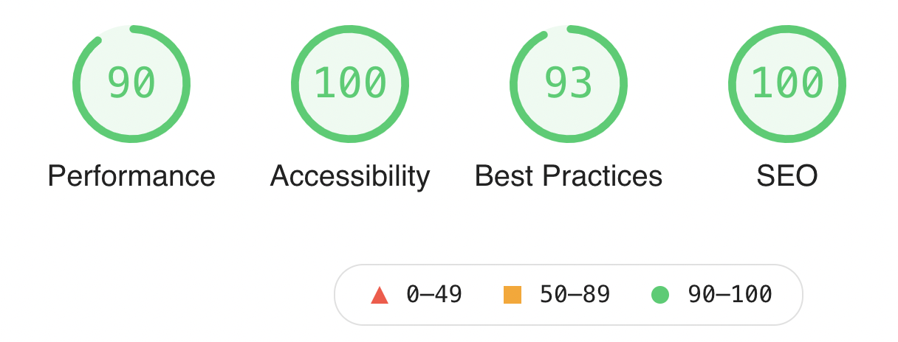

# Intro

Hi my name is Oli,

This is my application website for the Founders and Coders programme available at: https://duckrabbitpy.github.io/

For the best experience use Google Chrome or Firefox browser.

## Technologies and techniques used:

- HTML

  - Semantic HTML
  - Aria labels
  - Datalists and data attributes

 

- CSS

  - CSS Variables
  - CSS Grid and Flexbox
  - CSS Media queries
  - CSS @keyframe animations

 

- JavaScript

  - DOM manipulation and logical string interpolation
  - Session storage
  - Async/await and the Fetch() method
  - Object.create()
  - JSON.stringify()

 

## Google lighthouse score:

  

 
 

## What I enjoyed

- Building everything from the ground up and watching as the site developed in complexity and scale
- Applying what I have learnt about higher order methods to solve real problems
- I now have built up hours of dom manipulation practise and feel comfortable navigating the DOM

 

## What I found challenging

- Whenever I wanted to change the navbar or a complex element that repeats e.g. the input sliders (even a tiny change!) I had to do this over and over, which was repetitive and at times frustrating
- Sometimes I found targeting elements that were spatially seperate from the button being clicked or the key being pressed quite difficult as I could not use event.target in a straightforward way. I ended up using properties such as parentNode, firstElementChild and childNode, which worked well but it felt like I was 'hacking the DOM' and I'm sure there are better ways out there to acheive the same result
- I'm getting better but I did at times find achieving a truly responsive design challenging, and ended up with a very large css file! It was especially difficult because I was committed to providing the option to change font sizes which has a large impact on the layout. I also found after feedback from friends and family that certain things look/behave differently across browsers and devices such as the file uploader, input sliders and default buttons.

 

## What I'm looking forward to!

- Learning about managing user input, storing data and learning about how to improve performance
- Working with others on a larger project
